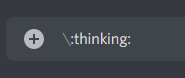
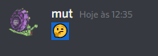
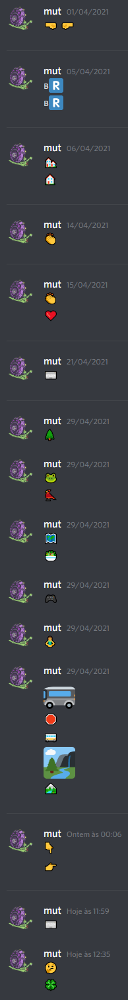

Custom Cursors
==================

For emoji cursors, you can just copy the following template.

```css
.cursor-name {
    cursor: url('data:image/svg+xml;charset=utf8,<svg xmlns="http://www.w3.org/2000/svg" viewBox="0 0 60 60" height="40" width="40"><text x="0" y="40" font-size="40">REPLACE WITH EMOJI</text></svg>'), auto;
}

/* eg */
.cursor-thinking {
    cursor: url('data:image/svg+xml;charset=utf8,<svg xmlns="http://www.w3.org/2000/svg" viewBox="0 0 60 60" height="40" width="40"><text x="0" y="40" font-size="40">🤔</text></svg>'), auto;
}
```

To get the emoji to the clipboard I usually go to [this link](https://emojipedia.org/thinking-face/) so I can copy it and then past it inside the text tag. 

Sometimes I also feel too lazy to go to that link and do it through discord. To do that, before sending the emoji message prepend a `\` to the message, so you get the 'raw' emoji:





🍀🍀 Good Luck 🍀🍀

